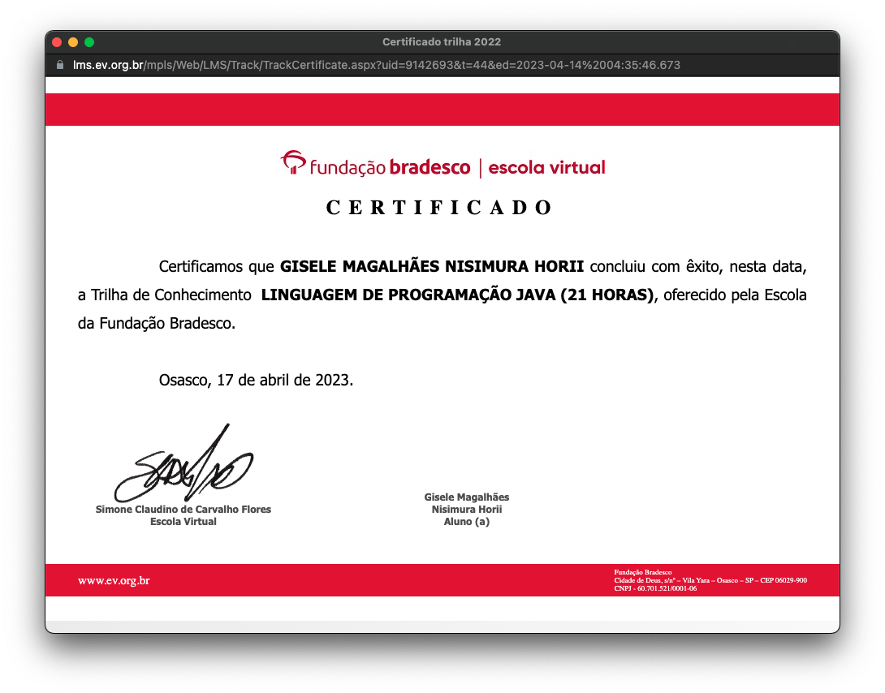

# Java Studies 

### Para desenvolvimento de conhecimentos, realizei um curso pela plataforma Fundação Bradesco. No qual foi abordado conceitos básicos e avançados referente a linguagem JAVA.

### Nesse repositório compartilho algumas atividades propostas durante o curso.

#### Durante o curso foi abordado conceitos de: 
<ul>
<li>básicos de linguage de programação</li>
<li>linguagem orientada a objeto</li>
<li>estrutura de decisão</li>
<li>estrutura de repetição</li>
<li>operadores</li>
<li>conceitos sobre variáveis</li>
<li>classes, métodos, pacotes</li>
<li>conceitos de POO - Encapsulamento, Herança, Abstração</li>
<li>tratamento de exceções (try..catch/ exception/ finally)</li>
<li>interface gráfica com uso dos pckgs Java</li>
<li>uso do drive JDBC para conexão ao Banco de Dados</li>
<li>Intergração ao Banco de Dados Oracle Express Edition</li>
 
</ul>

#### Certificado de conclusão:

